# Partie VM VirtualBox
# Les problemes renceontres 
## Guest Addition installation problem
Manually Mount Guest Additions:
If the automatic insertion doesn't work, you can try manually mounting the Guest Additions ISO.
1.	In the VirtualBox Manager, select your virtual machine.
2.	Click on "Settings."
3.	Go to the "System" tab.
4.	In the "Motherboard" tab, make sure "Floppy" is not checked.
5.	Click "OK" to save the settings.
6.	Start your virtual machine.
Now, try manually inserting the Guest Additions ISO:
•	In the running virtual machine window, go to the menu and select "Devices" > "Optical Drives" > "Choose a disk file."
•	Navigate to the location where you have the Guest Additions ISO and select it.
## Shared folder windows 7 
. Run Installer as Administrator:
•	Right-click on the VBoxWindowsAdditions-amd64.exe (or the appropriate version for your system) installer.
•	Choose "Run as administrator."
 ## Shared folder windows 7 

```Sudo adduser vboxuser vboxsf```

### Add user with all privileges
```
Su 
Apt install sudo 
Usermod -aG sudo user-name
```
# Configuration of vitual machine 
## ubuntu installation
<div style="text-align:center;">
  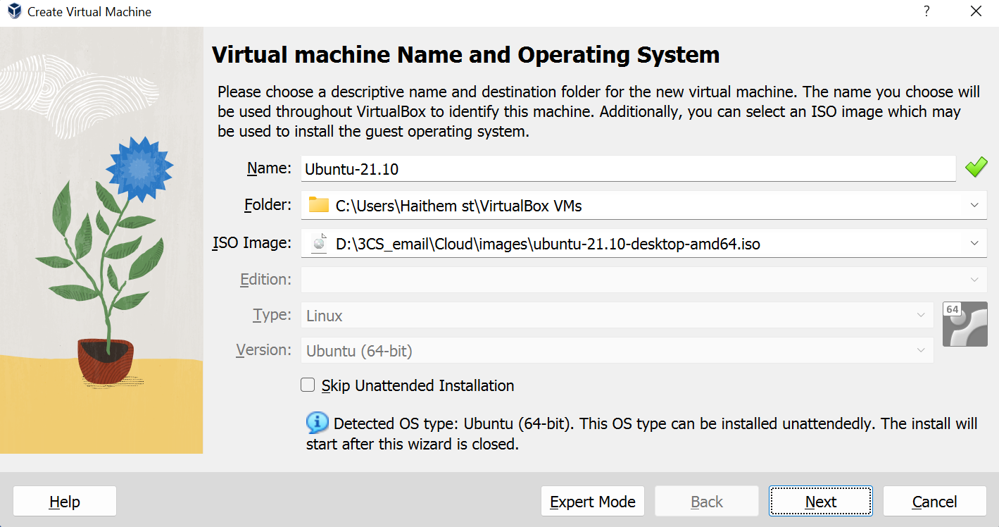
</div>
<div style="text-align:center;">
  
</div>
<div style="text-align:center;">
  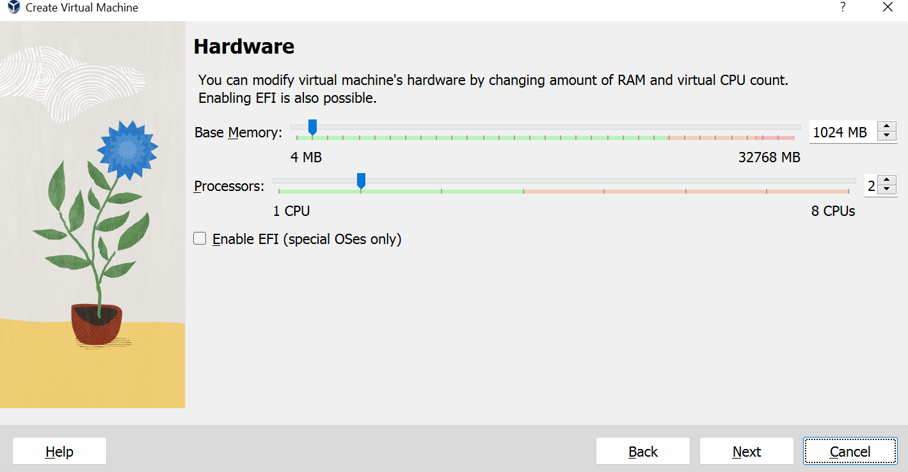
</div>
<div style="text-align:center;">
  
</div>
<div style="text-align:center;">
  
</div>

## windows 7 installation
<div style="text-align:center;">
  
</div>

<div style="text-align:center;">
  
</div>

<div style="text-align:center;">
  
</div>

<div style="text-align:center;">
  
</div>
<br>
<br>
<br>
<br>
<br>
<br>
<br>
<br>
<br>
<br>
<br>
<br>
<br>
<br>
<br>


## widows 7 clone
<div style="text-align:center;">
  
</div>

<div style="text-align:center;">
  
</div>

<div style="text-align:center;">
  
</div>


## shared file ubuntu

> - we need to click on Devices on the top menu of the virtual machine 
> - then we click to shared folder setting 
> - after click on the + on the right 
> - we configure the path on the host 
> - check auto-mount and make it permanent 
> - make the vboxuser suder user 
> - also we nedd to to add the user as vboxsf

<div style="text-align:center;">
  
</div>

<div style="text-align:center;">
  
</div>

<div style="text-align:center;">
  
</div>

<div style="text-align:center;">
  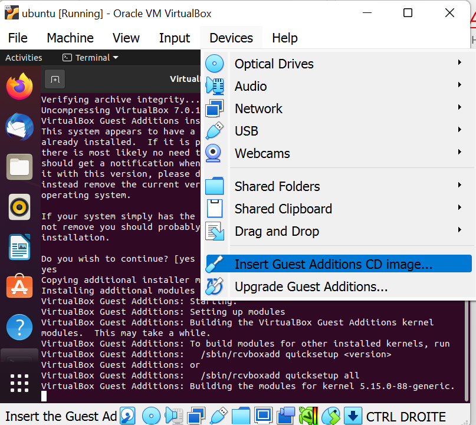
</div>

<div style="text-align:center;">
  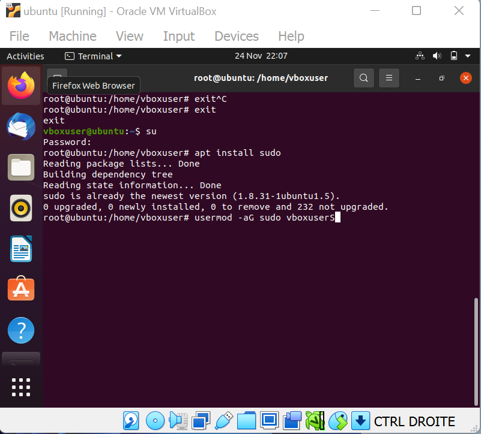
</div>

<div style="text-align:center;">
  
</div>

<div style="text-align:center;">
  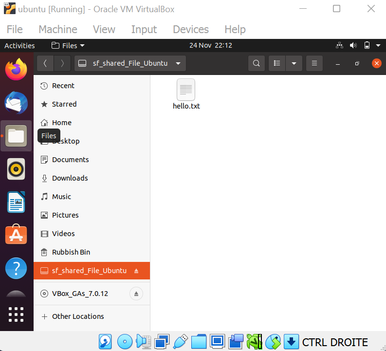
</div>

<div style="text-align:center;">
  
</div>

<div style="text-align:center;">
  
</div>

## shred file windows 7
> - Install vbox guest addition 
> - Turn on network discovery
> - configure shared folder setting ( shared folder path on host machine and make it permanent and auto-mount)
<div style="text-align:center;">
  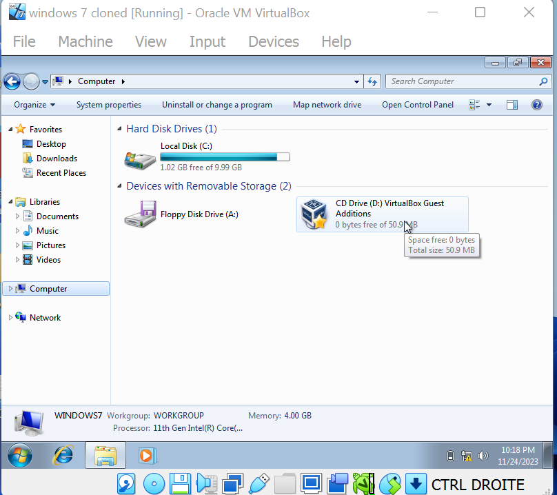
</div>

<div style="text-align:center;">
  
</div>

<div style="text-align:center;">
  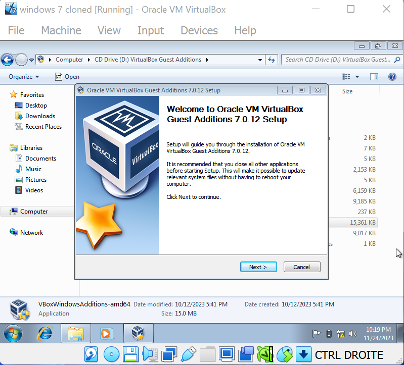
</div>

<div style="text-align:center;">
  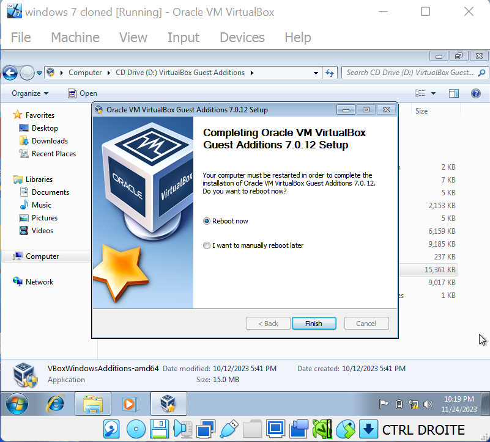
</div>

<div style="text-align:center;">
  
</div>

<div style="text-align:center;">
  
</div>

<div style="text-align:center;">
  
</div>

<div style="text-align:center;">
  
</div>

<div style="text-align:center;">
  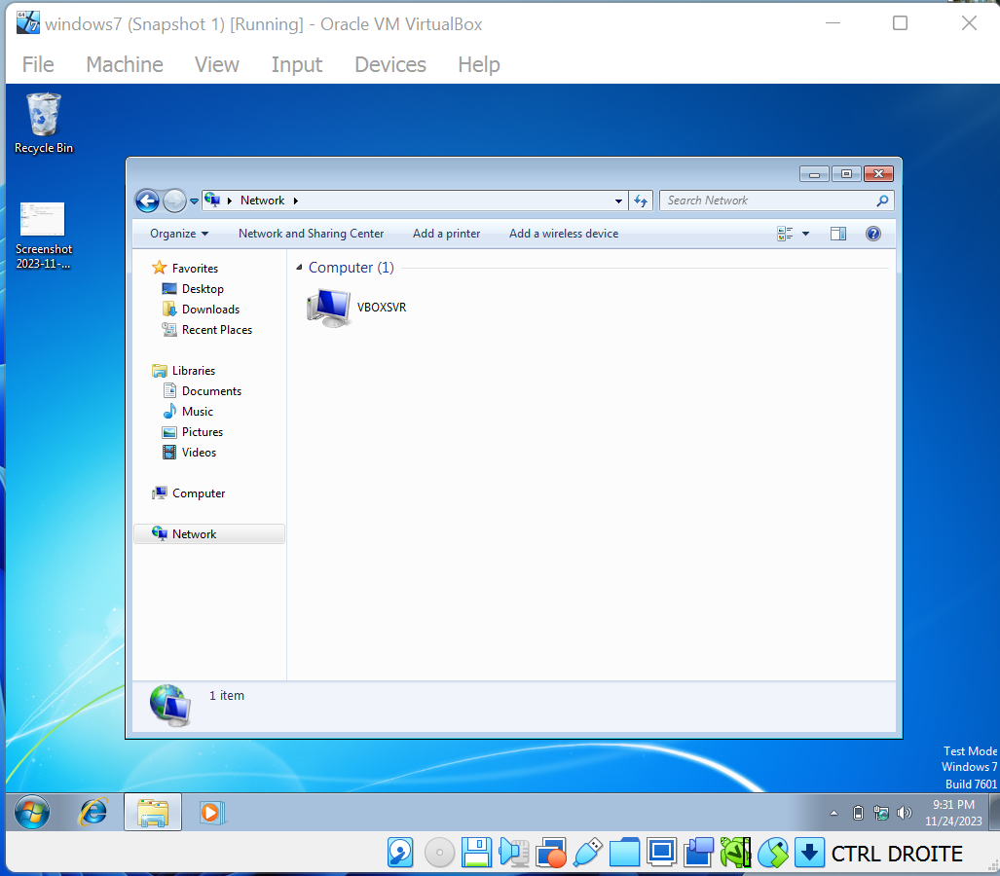
</div>

<div style="text-align:center;">
  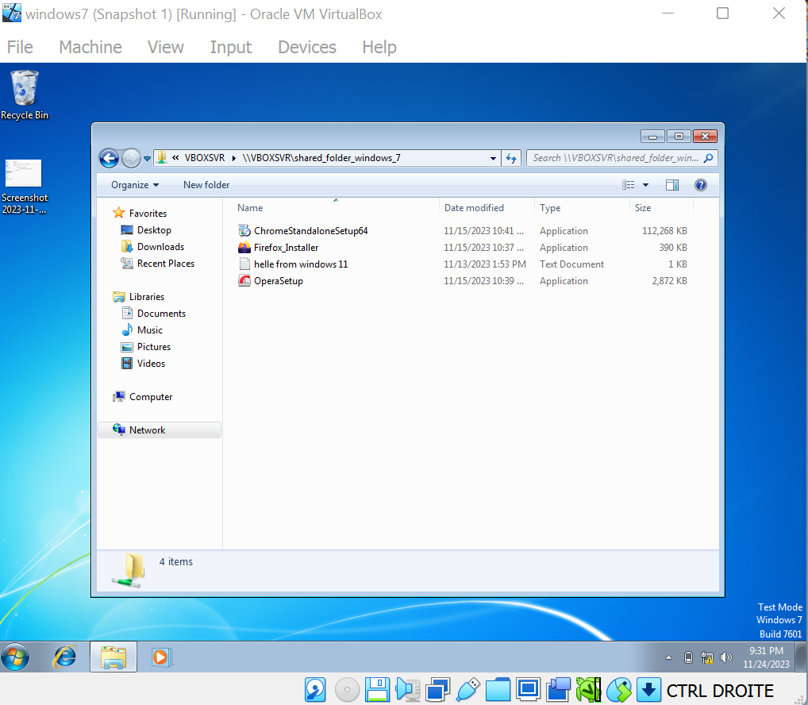
</div>

<div style="text-align:center;">
  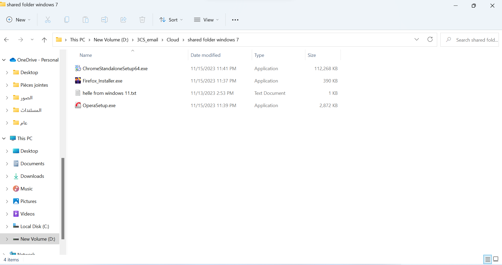
</div>


## share periphirique
> - insert the guest addition cd image 
> - enable bidirectionnal drag and drop
> - enable usb controller and select it 
<div style="text-align:center;">
  
</div>

<div style="text-align:center;">
  
</div>

<div style="text-align:center;">
  
</div>


## Take and restore snapshot
> - Go to machine and click to take snapshot
> - to restore click on vm and select snapshor after click to restore snapshot
<div style="text-align:center;">
  
</div>

<div style="text-align:center;">
  
</div>

## 6. Mettre les VMs dans un réseau privé (Host-Only) :
### − Utiliser le serveur DHCP virtuel pour attribuer des adresses IP aux VMs
> -  Go to tool after host only networks 
> -  configure adapter manually 
> - enable dhcp server and give it range of values²
<div style="text-align:center;">
  
</div>

<div style="text-align:center;">
  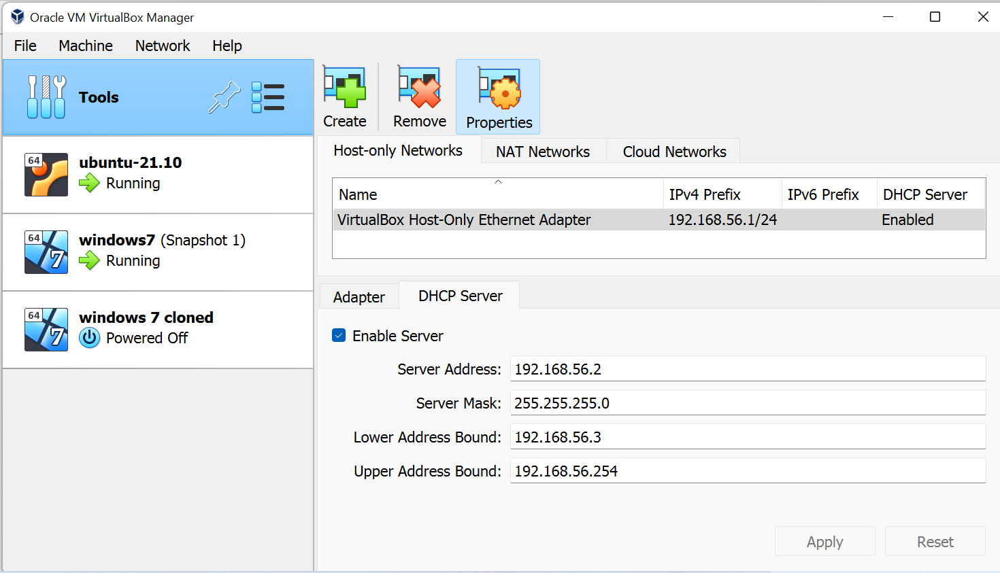
</div>

## Vérifier les adresses IP attribuées aux VMs.
<div style="text-align:center;">
  
</div>

<div style="text-align:center;">
  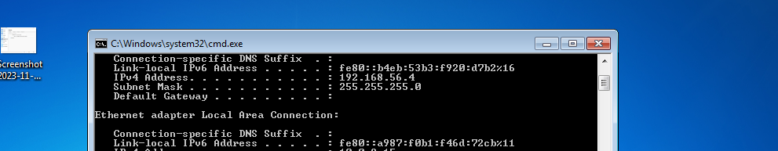
</div>

## Mettre l’hôte sur le même sous réseau que les VMs (vous pouvez utiliser un adressage statique pour mettre les VMs et l’hôte sur le même sous réseau).
<div style="text-align:center;">
  
</div>

<div style="text-align:center;">
  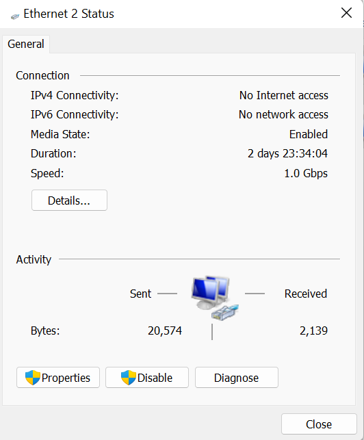
</div>

<div style="text-align:center;">
  
</div>

<div style="text-align:center;">
  
</div>

## Tester la communication/connexion inter VMs et entre les VMs et l’hôte (n’oubliez pas de désactiver le pare-feu).

> - we can ping between all the vms and host becasue we are under the same network
<div style="text-align:center;">
  
</div>

<div style="text-align:center;">
  
</div>

<div style="text-align:center;">
  
</div>

<div style="text-align:center;">
  
</div>

<div style="text-align:center;">
  
</div>

<div style="text-align:center;">
  
</div>

# 7. Mettre les VMs sur le mode de réseau virtuel NAT (NAT pour VMware Workstation et réseau NAT pour Oracle VM VirtualBox).
## − Utiliser le serveur DHCP virtuel pour attribuer des adresses IP aux VMs.
> - enable the dhcp server
<div style="text-align:center;">
  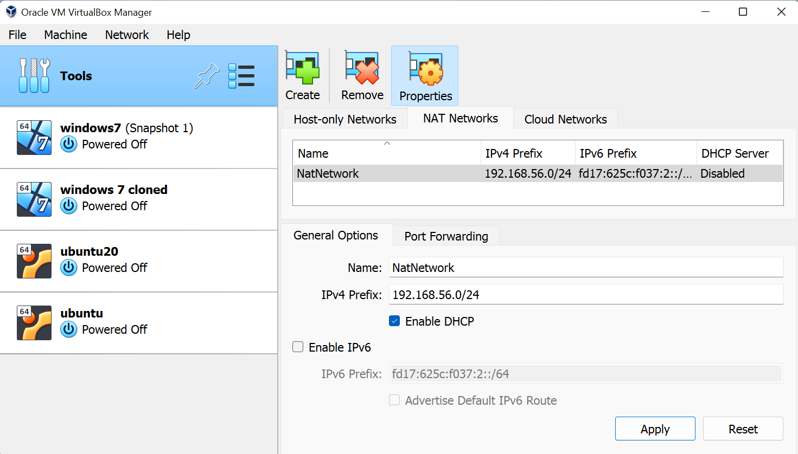
</div>

## − Vérifier les adresses IP attribuées aux VMs ainsi que la passerelle par défaut.

<div style="text-align:center;">
  
</div>

## − Connecter l’hôte à internet (vous pouvez utiliser le partage Internet entre vos smartphones et l’hôte).
<div style="text-align:center;">
  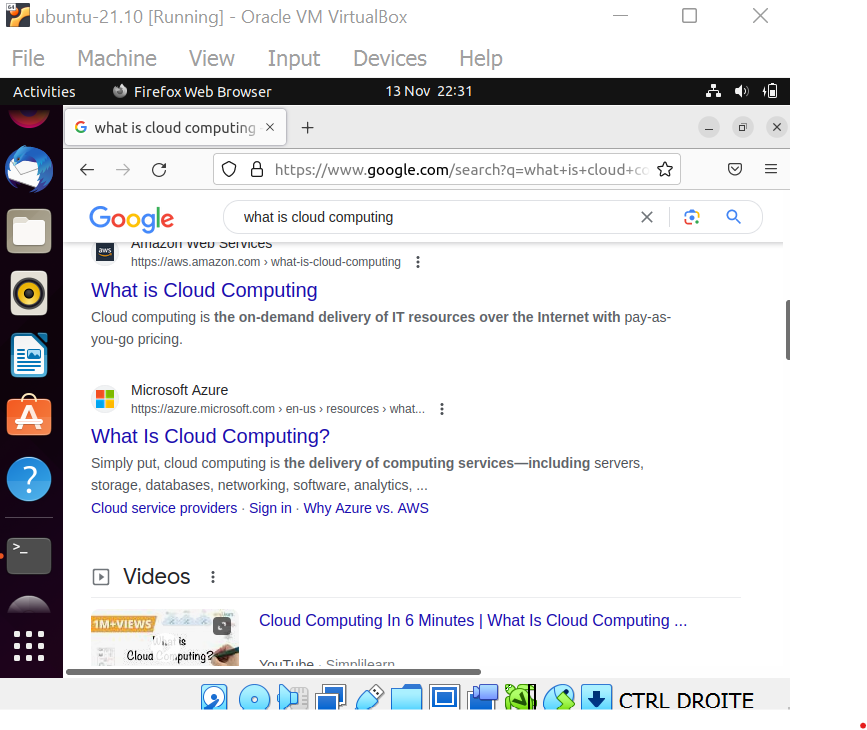
</div>

<div style="text-align:center;">
  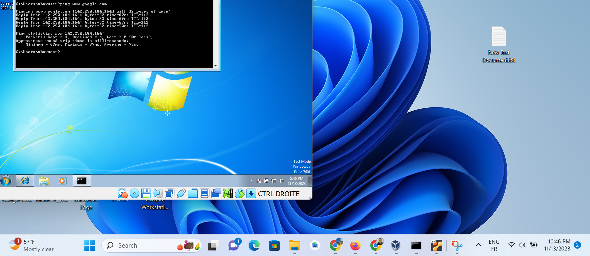
</div>

## − Tester la communication inter VMs, entre les VMs et l’hôte et l’accès des VMs à Internet.
> - we can ping normally
<div style="text-align:center;">
  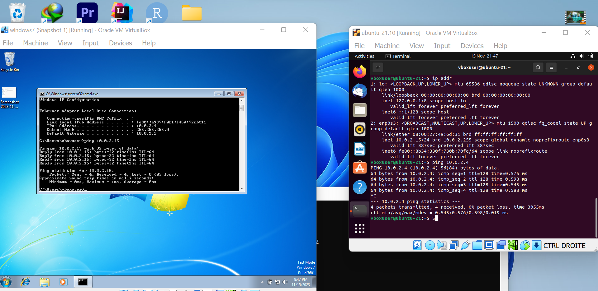
</div>

<div style="text-align:center;">
  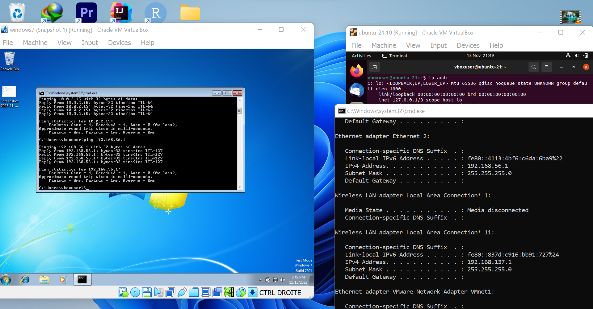
</div>

<div style="text-align:center;">
  
</div>

## − Créer et tester une règle de redirection de port (Port Forwarding).
> - install the apache server with the command 
```
sudo apt-get install apache2
```
> - lunch the server with the commmand 
```
sudo systemctl status apache2
```
<div style="text-align:center;">
  
</div>
<div style="text-align:center;">
  
</div>

> - define the regle of port forwarding on the configuration

<div style="text-align:center;">
  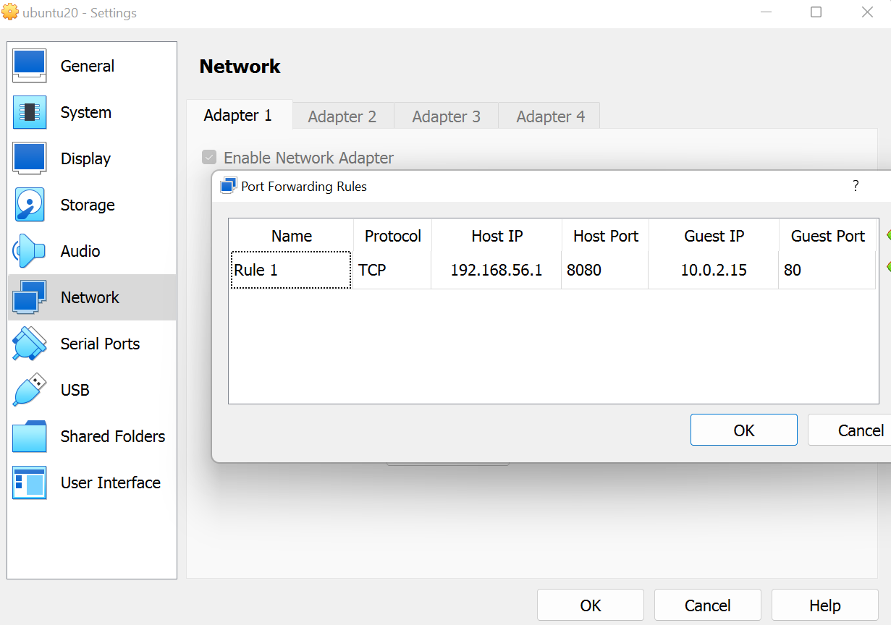
</div>

> - test apache on the vm 

<div style="text-align:center;">
  
</div>

> - use the port defined on the rule of port forwarding 8080 on the host machine 
<div style="text-align:center;">
  
</div>


# 8. Mettre les VMs sur le mode de réseau virtuel Bridged.
## − Utiliser le serveur DHCP externe pour attribuer des adresses IP à l’hôte et aux VMs (vous pouvez utiliser le serveur DHCP de vos smartphones).
<div style="text-align:center;">
  
</div>

## Utiliser le mode automatique pour la connexion directe avec le réseau externe (bridged to), sinon choisir l’interface réseau physique de l’hôte connectée au réseau externe.
<div style="text-align:center;">
  
</div>


## − Vérifier les adresses IP attribuées à l’hôte et aux VMs ainsi que la passerelle par défaut (li faut s’assurer que l’hôte et les VMs se trouvent dans le même sous réseau)

<div style="text-align:center;">
  
</div>

## − Vérifier que l’hôte est connecté à Internet
<div style="text-align:center;">
  
</div>

## Tester la communication inter VMs, entre les VMs et l’hôte et l’accès des VMs à Internet.
> - ping work between all machines
<div style="text-align:center;">
  
</div>
<div style="text-align:center;">
  
</div>
<div style="text-align:center;">
  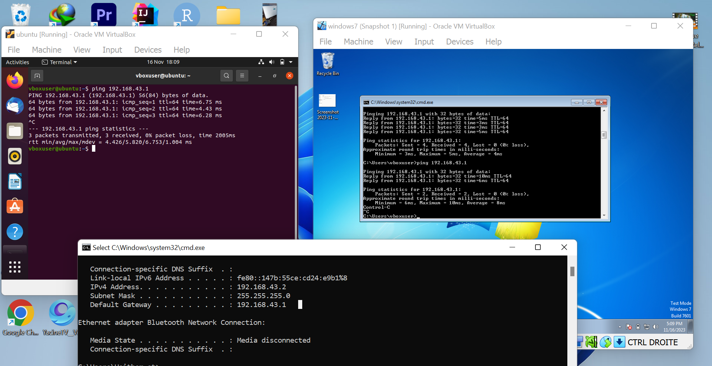
</div>


# 9. Mettre les deux VMs sur deux modes de réseau virtuel différents (une VM sur le mode Host-Only et l’autre sur le mode réseau NAT).
<div style="text-align:center;">
  
</div>

<div style="text-align:center;">
  
</div>

## Désactiver le serveur DHCP virtuel pour les deux modes.
<div style="text-align:center;">
  
</div>

<div style="text-align:center;">
  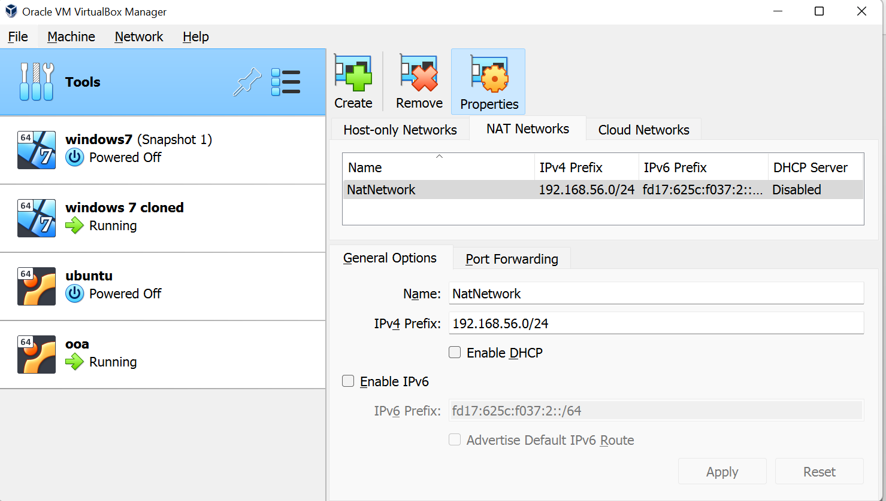
</div>

<div style="text-align:center;">
  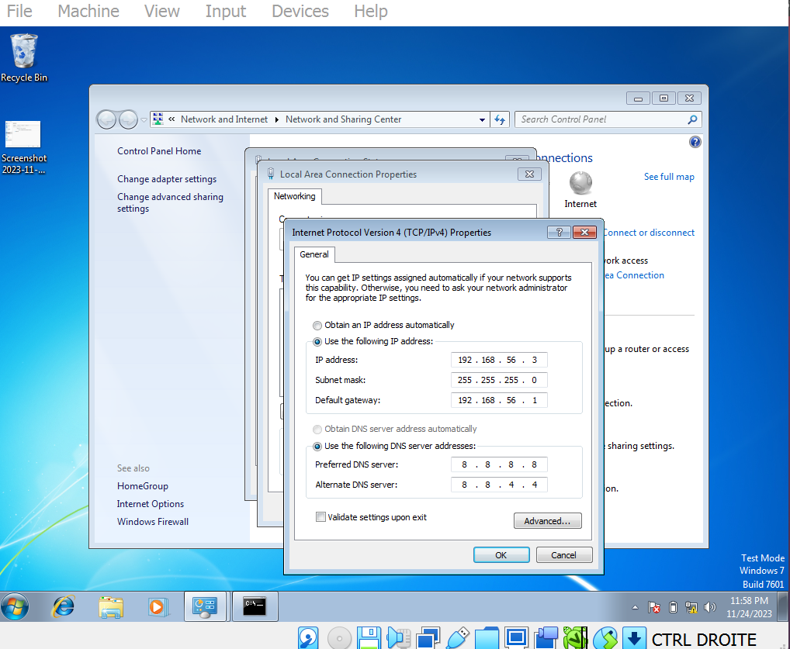
</div>

<div style="text-align:center;">
  
</div>

> - we can't ping on this case 
<div style="text-align:center;">
  
</div>

<div style="text-align:center;">
  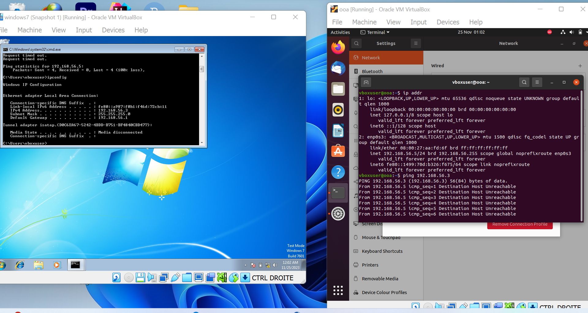
</div>


# **Partie VMware**

# Créer une duplication (clone) de l’état actuel de la VM Windows 7 (full réplication).

<center>
<div style="text-align:center;"></div>
  
</div>

> Une nouvelle machine clone a été créée.


<br>

<div style="text-align:center;">
  
</div>

<br>
<br>
<br>
<br>
<br>

# Configurer un partage de fichiers entre la VM et l'hôte.


> - On doit d’abord aller vers les parametre de machine viruelle → options → Shared Folder  et le modifier vers “Always enabled” et ajouter le chemain du dossier dans la machine host
>- On doit installer Vmware Tools pour qu’on puisse faire le partage entre la machine host et guest.
>- On peut voire que le fichier est bien partage entre la machine host et guest.


<div style="text-align:center;">
  
</div>


<div style="text-align:center;">
  
</div>

<div style="text-align:center;">
  
</div>

<div style="text-align:center;">
  
</div>

<br>
<br>
<br>
<br>
<br>
<br>
<br>
<br>
<br>

# Configurer un partage des périphériques entre la VM et l'hôte.


> On ajoute un nouveau périphériques. et on notice que l’on peut voire sur la machine host et guest


<div style="text-align:center;">
  
</div>

# Créer et restaurer une image instantanée (snapshot) pour la VM Windows 7.


 > Pour prendre une snapshot dans vmware , on clique sur VM → Snapshot → Take Snapshot


<div style="text-align:center;">
  
</div>


 > Pour restaurer un snaphshot on clique sur : revert to Snapshot : Snapshot windows 7 , et on va voire qu’on a reviendrai dans la meme etat et la position ou on a creee le snapshot


<br>
<br>
<br>

# Mettre les VMs dans un réseau privé (Host-Only) :

<div style="text-align:center;">
  
</div>


 > l’intervalle de reseau et de 192.168.157.128 → 192.168.157.254


### Ip address pour Windows 7 et Ubuntu

<div style="text-align:center;">
  
</div>

<div style="text-align:center;">
  
</div>


192.168.221.3

<br>
<br>

<div style="text-align:center;">
  
</div>

192.168.221.4

> toutes le machine sont dans le meme reseau

> On teste la connectivite

<div style="text-align:center;">
  
</div>

<div style="text-align:center;">
  
</div>

<div style="text-align:center;">
  
</div>


# Mettre les VMs sur le mode de réseau virtuel NAT

<div style="text-align:center;">
  
</div>

<div style="text-align:center;">
  
</div>

192.168.26.128

<div style="text-align:center;">
  
</div>

192.168.26.129

<div style="text-align:center;">
  
</div>

>ping de les vm vers l’hote

<div style="text-align:center;">
  
</div>

>acceder vers l’internet a partir les vms

<div style="text-align:center;">
  
</div>

## Port forwarding

<div style="text-align:center;">
  
</div>


 >on peut acceder vers le server apache a travers notre host


<div style="text-align:center;">
  
</div>


# 8. Mettre les VMs sur le mode de réseau virtuel Bridged.

<div style="text-align:center;">
  
</div>

## L’attribution des addresses IPHost

<div style="text-align:center;">
  
</div>

Ubuntu→ 192.168.34.211

<div style="text-align:center;">
  
</div>

Windows7 → 192.168.34.45

<div style="text-align:center;">
  
</div>
                                                                Host → 192.168.34.99


 >Toutes les machine sont dans le meme sous reseau , et la machine host est connecte a l’internet (on peut pinger 8.8.8.8)
Le pasrelle par default est : 192.168.34.215


## Teste de connectivite entre les machines

<div style="text-align:center;">
  
</div>

>ping ubuntu vers windows7

<div style="text-align:center;">
  
</div>

>ping windows7 vers ubuntu

<div style="text-align:center;">
  
</div>


>ping windows ver ubuntu et windows7

## Teste de connectivite vers l’internet

<div style="text-align:center;">
  
</div>

>Windows7 peut connecter a l’internet

<div style="text-align:center;">
  
</div>

>Ubuntu peut connecter a l’internet

# 9. Mettre les deux VMs sur deux modes de réseau virtuel différents (une VM sur le Nat et autre sur Host-Only)


 >Le server DHCP est desactive dans les deux vm
Windows7 → NAT
Ubuntu → Host-Only


<div style="text-align:center;">
  
</div>


 >On va attribuer un ip static pour chacune des machines virtuelles


<div style="text-align:center;">
  
</div>

<div style="text-align:center;">
  
</div>

ip ubuntu : 192.168.1.21

ip windows7 : 192.168.1.20


<div style="text-align:center;">
  
</div>

> On peut pas faire une connection entre  le windows et ubuntu


