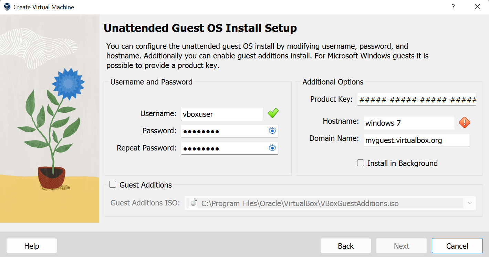
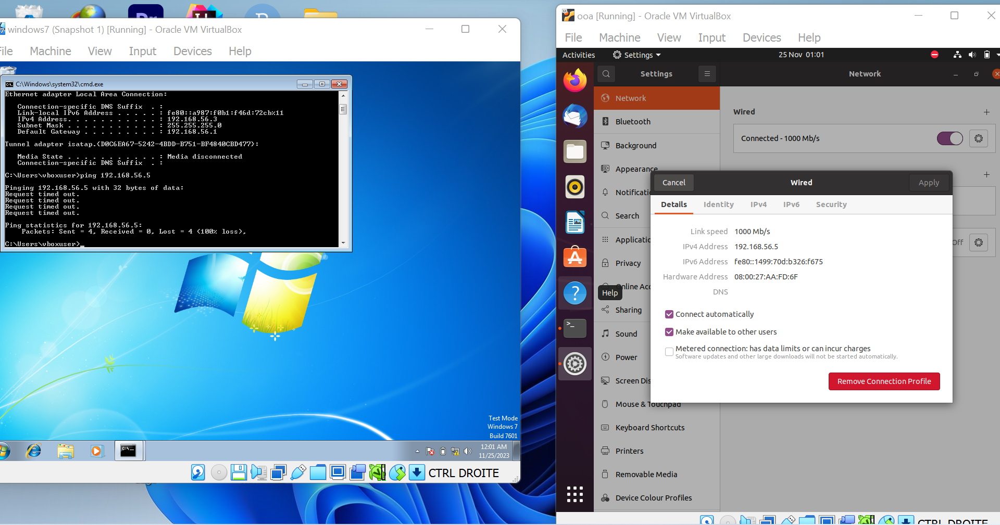

# Partie VM VirtualBox
## Definition de la machine virtuellle : 
Une machine virtuelle (VM), en informatique, est une émulation logicielle d'un ordinateur physique. Elle permet à un seul ordinateur physique (appelé hôte) d'exécuter plusieurs systèmes d'exploitation simultanément. Chaque machine virtuelle fonctionne comme un ordinateur autonome avec son propre système d'exploitation (invité) et ses applications, mais elle partage les ressources matérielles de l'hôte, telles que le processeur, la mémoire et le stockage.

L'utilisation de machines virtuelles offre plusieurs avantages, notamment l'isolation des environnements, la consolidation des ressources, la facilité de gestion, la migration des applications entre différentes plates-formes, et la possibilité de tester des logiciels dans des environnements contrôlés. Les hyperviseurs (ou moniteurs de machines virtuelles) sont des logiciels ou des matériels qui permettent de créer et de gérer ces machines virtuelles sur l'hôte physique.

En résumé, une machine virtuelle est une instance logicielle d'un ordinateur qui fonctionne de manière indépendante sur un serveur physique, permettant ainsi l'exécution de plusieurs systèmes d'exploitation et applications sur une seule machine physique.

## Hyperviseur 
Un hyperviseur, également appelé moniteur de machines virtuelles, est un logiciel ou un matériel qui permet la création et la gestion de machines virtuelles sur un serveur physique. Il existe deux types d'hyperviseurs :

### Hyperviseur de type 1 (ou natif) :
Il s'exécute directement sur le matériel physique et n'a pas besoin d'un système d'exploitation hôte. Il a un accès direct aux ressources matérielles, offrant ainsi des performances généralement meilleures. Exemples : VMware ESXi, Microsoft Hyper-V.

### Hyperviseur de type 2 (ou hébergé) : 
Il s'exécute comme une application sur un système d'exploitation hôte. Il utilise les ressources du système d'exploitation sous-jacent pour créer et gérer des machines virtuelles. Exemples : VMware Workstation, Oracle VirtualBox.
## Emulateur :
Un émulateur est un logiciel ou un matériel qui permet à un système informatique (l'hôte) de reproduire le comportement d'un autre système informatique (l'invité) de manière à pouvoir exécuter des logiciels conçus pour cet autre système. Les émulateurs sont souvent utilisés pour exécuter des programmes conçus pour une architecture matérielle ou un système d'exploitation différent.
## Comparaison entre Hyperviseur et Emulateur :
### Niveau d'isolation :
Les hyperviseurs créent des machines virtuelles qui partagent les ressources physiques mais fonctionnent de manière isolée les unes par rapport aux autres.
Les émulateurs émulent complètement le matériel, permettant l'exécution d'un système d'exploitation différent, mais généralement avec une performance moindre.
### Performance 
Les hyperviseurs, en particulier de type 1, ont généralement de meilleures performances car ils ont un accès direct aux ressources matérielles.
Les émulateurs peuvent être plus lents car ils doivent émuler complètement le matériel, ce qui peut entraîner une surcharge.
### Utilisation :
Les hyperviseurs sont couramment utilisés dans la virtualisation de serveurs et de data centers.
Les émulateurs sont souvent utilisés pour exécuter des applications conçues pour des plates-formes différentes (par exemple, exécuter des jeux conçus pour une console sur un PC).
### Exemple d'application :
Les hyperviseurs sont utilisés pour la virtualisation de machines et la gestion des ressources dans des environnements professionnels.
Les émulateurs sont utilisés pour exécuter des jeux vidéo, des anciens systèmes d'exploitation, ou des applications spécifiques.
En résumé, les hyperviseurs sont principalement utilisés pour la virtualisation de machines, tandis que les émulateurs sont utilisés pour exécuter des logiciels conçus pour d'autres systèmes ou architectures matérielles.

# Some possible problem 
## Guest Addition installation problem
Manually Mount Guest Additions:
If the automatic insertion doesn't work, you can try manually mounting the Guest Additions ISO.
1.	In the VirtualBox Manager, select your virtual machine.
2.	Click on "Settings."
3.	Go to the "System" tab.
4.	In the "Motherboard" tab, make sure "Floppy" is not checked.
5.	Click "OK" to save the settings.
6.	Start your virtual machine.
Now, try manually inserting the Guest Additions ISO:
•	In the running virtual machine window, go to the menu and select "Devices" > "Optical Drives" > "Choose a disk file."
•	Navigate to the location where you have the Guest Additions ISO and select it.
## Shared folder windows 7 
. Run Installer as Administrator:
•	Right-click on the VBoxWindowsAdditions-amd64.exe (or the appropriate version for your system) installer.
•	Choose "Run as administrator."
 ## Shared folder windows 7 

```Sudo adduser vboxuser vboxsf```

### Add user with all privileges
```
Su 
Apt install sudo 
Usermod -aG sudo user-name
```
# Configuration of vitual machine 
## ubuntu installation


## windows 7 installation




## widows 7 clone


## shared file ubuntu


## shred file windows 7


## share periphirique


## Take and restore snapshot


## 6. Mettre les VMs dans un réseau privé (Host-Only) :
### − Utiliser le serveur DHCP virtuel pour attribuer des adresses IP aux VMs


## Vérifier les adresses IP attribuées aux VMs.


## Mettre l’hôte sur le même sous réseau que les VMs (vous pouvez utiliser un adressage statique pour mettre les VMs et l’hôte sur le même sous réseau).


## Tester la communication/connexion inter VMs et entre les VMs et l’hôte (n’oubliez pas de désactiver le pare-feu).


# 7. Mettre les VMs sur le mode de réseau virtuel NAT (NAT pour VMware Workstation et réseau NAT pour Oracle VM VirtualBox).
## − Utiliser le serveur DHCP virtuel pour attribuer des adresses IP aux VMs.

## − Vérifier les adresses IP attribuées aux VMs ainsi que la passerelle par défaut.

## − Connecter l’hôte à internet (vous pouvez utiliser le partage Internet entre vos smartphones et l’hôte).


## − Tester la communication inter VMs, entre les VMs et l’hôte et l’accès des VMs à Internet.


## − Créer et tester une règle de redirection de port (Port Forwarding).


# 8. Mettre les VMs sur le mode de réseau virtuel Bridged.
## − Utiliser le serveur DHCP externe pour attribuer des adresses IP à l’hôte et aux VMs (vous pouvez utiliser le serveur DHCP de vos smartphones).

## Utiliser le mode automatique pour la connexion directe avec le réseau externe (bridged to), sinon choisir l’interface réseau physique de l’hôte connectée au réseau externe.


## − Vérifier les adresses IP attribuées à l’hôte et aux VMs ainsi que la passerelle par défaut (li faut s’assurer que l’hôte et les VMs se trouvent dans le même sous réseau)


## − Vérifier que l’hôte est connecté à Internet

## Tester la communication inter VMs, entre les VMs et l’hôte et l’accès des VMs à Internet.


# 9. Mettre les deux VMs sur deux modes de réseau virtuel différents (une VM sur le mode Host-Only et l’autre sur le mode réseau NAT).


## Désactiver le serveur DHCP virtuel pour les deux modes.





